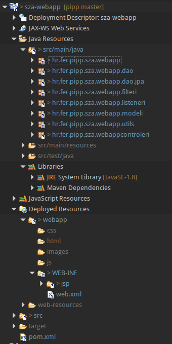

# Sustav za anketiranje - Projekt iz programske potpore

## Upute za instalaciju

  * ###### Pripremanje Eclipsa
    1. Pokrenite Eclipse for JEE Developers i odaberite neki svoj workspace
    2. Ukoliko nemate, dodajte novi Tomcat server u Eclipse:
      - File -> New -> Other...
      - Server -> Next
      - Tomcat v8.0 Server -> Server runtime environment -> Add
      - Odaberite direktorij gdje ste instalirali Apache Tomcat 8 (ili raspakirali [apache-tomcat-8.0.30.zip](http://ftp.carnet.hr/misc/apache/tomcat/tomcat-8/v8.0.30/bin/apache-tomcat-8.0.30.zip))
    3. Instalirajte m2e connector za EGit
      - Odaberite novi maven projekt iz SCM-a (File -> New -> Other... -> Check out Maven projects from SCM -> Next)
      - Kliknite na link m2e Marketplace u polju _Find more SCM connectors in the m2e Marketplace_
      - Pri dnu liste se nalazi _m2e-egit_, Instalirajte ga i restartajte Eclipse
    4. (Opcionalno) Korisne postavke za Eclipse:
      - Preferences -> Java -> Java Editor -> Save Actions; omogućite:
      - Perform the selected actions on save
      - Format source code (Format all lines)
      - Organize imports
      - Additional actions

  * ###### Dodavanje repozitorija kroz EGit
    1. Otvorite Git perspektivu (Window -> Perspective -> Open perspective -> Other... -> Git -> OK)
    2. Ako imate projekt već skinut s GitHuba na disk:  
       - Odaberite _Add an existing local Git Repository to this view_
       - Odaberite direktorij u kojem se nalazi Git repozitorij -> Finish
    3. Ako nemate, ili želite iznova:  
       - Odaberite _Clone a Git Repository and add the clone to this view_
       - URI: https://github.com/beslic/pipp.git
       - Authentication: vaš GitHub username i password -> Next
       - (odabrana je master grana) -> Next
       - Odaberite direktorij u kojem ćete spremiti Git repozitorij; može biti bilo koji direktorij, ali **mora** biti prazan; **ne** preporuča se koristiti isti direktorij za Git repozitorij kao za Eclipse workspace
     4. (Opcionalno) Pregledajte strukturu direktorija u Git perspektivi, posebno obratite pažnju na _Working directory_


  * ##### Dodavanje projekta
    1. U Git perspektivi, desni klik na Git repozitorij ili na _Working directory_ -> Import Maven projects...
    2. Pojavit će se projekt /sza-webapp/pom.xml, odaberite ga -> Finish
    3. Otiđite u Java EE perspektivu -> u Project Exploreru s lijeve strane bi se trebao nalaziti projekt
    4. Desni klik na projekt -> Maven -> Update project
    5. (Opcionalno) Desni klik na projekt -> Maven -> Download sources


  * ##### Objašnjenje strukture projekta  

    

    - Deployment Descriptor: sza-webapp  
      Ljepši prikaz svega sto se nalazi u `web.xml` i u dodatnim mapiranjima u klasama

    - JAX-WS Web Services  
      nebitno

    - Java Resources
    ```  
      src/main/java  - sve .java klase koje ćemo koristit i sve ono ključno za projekt  
                └── hr.fer.pipp.sza.webapp.kontroleri  - svi kontroleri za web aplikaciju
                └── hr.fer.pipp.sza.webapp.dao  - sučelja koja definiraju pristup sloju za perzistenciju
                └── hr.fer.pipp.sza.webapp.dao.jpa  - klase koje implementiraju DAO sučelja
                └── hr.fer.pipp.sza.webapp.filter  - filteri koje koristi web aplikacija
                └── hr.fer.pipp.sza.webapp.listeneri  - listeneri koje koristi web aplikacija
                └── hr.fer.pipp.sza.webapp.modeli  - svi modeli koji se koriste u web aplikaciji
                └── hr.fer.pipp.sza.webapp.utils  - dodatne pomoćne klase (ne moraju imati veze s web aplikacijom ali se koriste u npr. kontrolerima)

      src/main/resources  - nebitno

      src/test/java  - testne klase (nećemo se još time baviti)
      ```  

      - Libraries sve biblioteke  
        - JRE System Libraries - osnovne biblioteke
        - Maven Dependencies - sve biblioteke koje su u `pom.xml` i biblioteke o kojima ovise

      - JavaScript Resources  
      nebitno

      - Deployed Resources
      ```
        webapp/  - tu se nalaze svi statički resursi kojima se smije pristupiti
          └── css/  - sve .css datoteke
          └── html/  - sve .html datoteke
          └── images/  - sve slike
          └── js/  - sve .js datoteke
          └── WEB-INF/  - sve datoteke kojima se ne može pristupiti bez posredstva kontrolera
                └── jsp/  - sve .jsp datoteke
                └── web.xml  - opisnik web aplikacije

        web-resources/  - nebitno

        (napomena: Git neće spremiti prazan direktorij; kada preuzmete projekt s GitHuba u njemu nećete imati ove direktorije, ali ako trebate spremiti neku od ovih datoteka, spremate ih u direktorije koji se ovako zovu i ovdje se nalaze)
      ```
      - src  
      sve nabrojano se nalazi u ovom folderu, sve u ovom folderu je u izvornom kodu i kao tavko se sprema na GitHub (ovo je početni direktorij svega što se nalazi u projektu)

      - target  
      sve `.class` datoteke, sav kompajlirani kod, dodatni opisnici web aplikacije koji se generiraju; ne sprema se na GitHub

      - `pom.xml`  
      maven opisnik projekta, definira sve potrebne biblioteke, sprema se na GitHub


  * ##### Korištenje EGita

    TODO


  * ##### Korištenje mavena

    TODO


  * ##### Konfiguriranje Hibernatea

    TODO


## Dokumentacija Projekta

... todo

### [Definicija projekta](definicija-projekta.md)

### [ER Model](opis-baze-podataka.md)

### [Bilješke sa sastanaka](https://docs.google.com/document/d/1tqYlR7wgnotYuYYfDRm2xOz4JlXo75b7VYI6A7NRgK4/edit)
