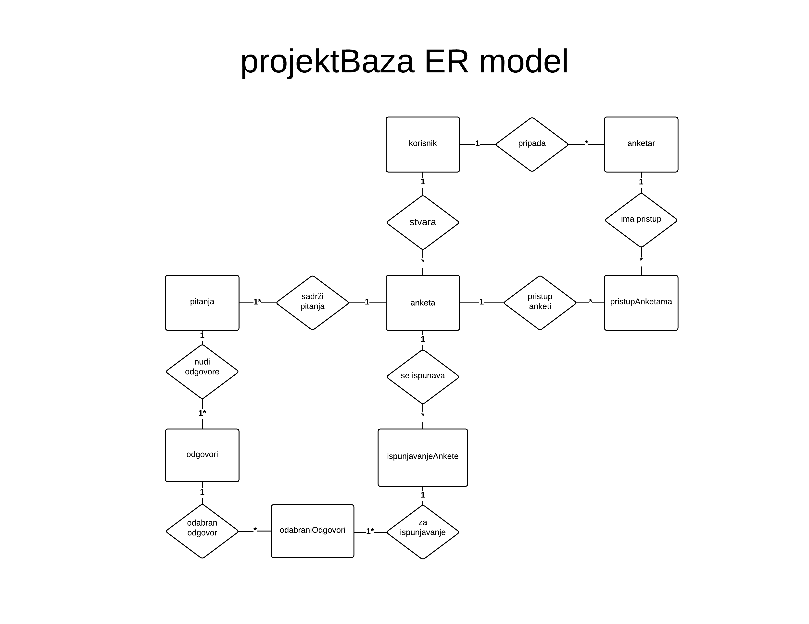

# **projektBaza** baza podataka

Baza podataka **projektBaza** tematski pokriva podatke o svim korisnicima web aplikacije za anketno istraživanje, te podake dobivene anketnim istraživanjima. Prate se osobni podatci o svakom naručitelju, te podatci o njemu pridruženim anketarima. Za svakog anketara prati se kojem korisniku pripada te koje ankete su mu dostupne. Za svaku anketu prate se pitanja postavljena u anketi, ponuđeni odgovori te detaljni podatci o svakom ispunjavanju ankete.

Popis tablica i njihovo značenje:

**korisnik**:
Osobni podatci o korisniku koji ukjučuju: ime, prezime, ime kompanije(ako postoji), E-mail, username i password.

**anketar**:
Osnovni podatci o anketaru. Uključuju username i password te id korisnika kojem je predodređen.

**pristupAnketama**:
Sadži popis dopuštenja pristupa anketama svakog anketara.

**anketa**:
Sadrži osnovne podatke o anketi. To su: ime ankete, id korisnika koji provodi anketu i podatke o privatnosti.

**pitanja**:
Popis svih pitanja za određenu anketu. Svako pitanje sadrži tekst pitanja i id ankete kojoj pripada. Sadrži broj koliko puta je pitanje odgovoreno.

**odgovori**:
Popis svih odgovora za određenu anketu. Svako odgovor sadrži tekst odgovora i id pitanja kojem pripada. Sadrži broj koliko puta je odgovor odabran.

**ispunjavanjeAnkete**:
Osnovni podatci o svakom ispunjavanjuankete. Svakom ispunavanu ankete dodjeljuje se vrijeme ispunjavanja, geolokacija te id ankete koja se ispunjava.

**odabraniOdgovori**:
Podatci o svakom odabranom odgovoru. Svaki red tablice samo zahtjeva id ispunjavanja ankete i id odgovora koji je odabran.

# ER model

